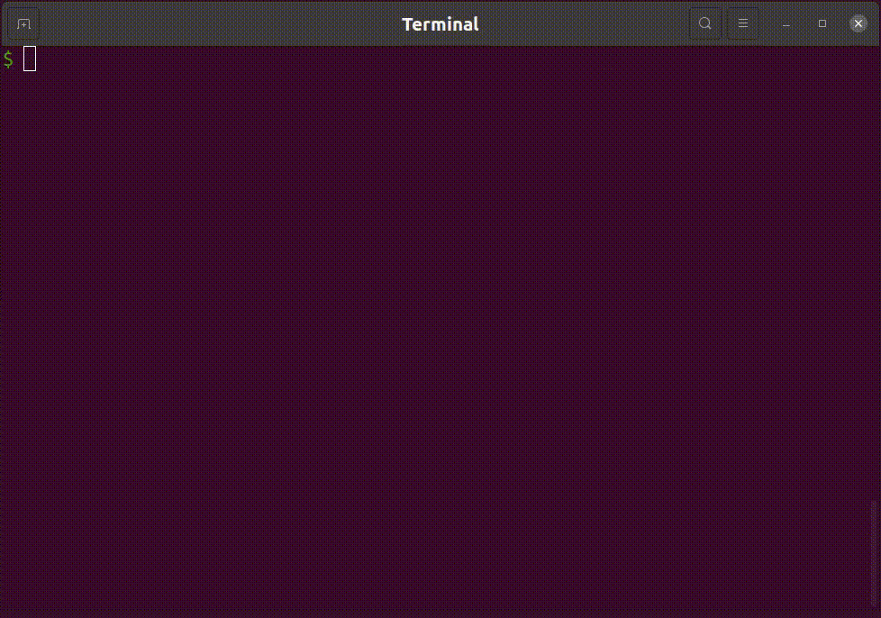

2020年1月頃からパスワードマネージャに [Enpass](https://www.enpass.io) を使っていたが、最近 1Password に戻した。

# なぜ Enpass を使っていたのか

そもそも2018年くらいまでは 1Password を長らく使っていた。
この 1Password は買い切りのライセンスなので使い続けることはできたけども、バージョンが6だった。
なので更新が止まってしまったこともあって、 1Password を一度脱却した。

その後に使っていたのは [bitwarden](https://bitwarden.com) で、その後に Enpass に移った。

パスワードマネージャのデータベースはなるべくローカルに持ちたかったので Enpass を採用していた。

# Enpass から 1Password へ

Enpass のライセンスは1年で、それが切れるというのが移行の同期。

ちょうどライセンスが切れるから見直すかと思い、また 1Password に戻ることにした。

# サブスクリプションか買い切りか

1Password の買い切りライセンスは一度なくなったがその後復活し、こっそりと継続されている。
この買い切りライセンスは6500円（税抜き）くらい。

AgileBits はサブスクリプション推しだが、次の理由で買い切りライセンスにした。

1. サブスクリプションを2年使ったら買い切りの方が安い
2. クラウドにお金を払いたくない
    1. Dropbox を有料で使っているのでデータはなるべく Dropbox で同期したい。新たにクラウドストレージのようなサービスにお金を払いたくはない

# プラットフォーム問題

Mac版は特に問題がないとして、普段使っている Linux 環境が一番の課題。

実は [Linux 向けのクライアント](https://blog.1password.com/1password-for-linux-beta-is-now-open/) が2020年10月にベータリリースされていた。
これは使えるじゃんということで 1Password への移行を決定した。

Linux 版のクライアントが存在することが決め手だったが、 Linux 版のクライアントで使えるのは [1password.com](http://1password.com) のアカウントのみで、 Dropbox 等で同期している場合は使えなかった。

# Linux 版のクライアントを作った

Linux 版ではパスワードの参照ができればいいと割り切ってそれだけができるクライアントを作った。

1Password のデータベースファイルの [フォーマットはオープン](https://support.1password.com/opvault-design/) なのでこういったクライアントを作ることもできる。

実はこのクライアント、見かけ以上に複雑なことをしていてサーバーとクライアントに分かれて動作している。

サーバーがデータベースファイルへアクセスしているので一度マスターパスワードを使って復号化するとしばらくの間はマスターパスワードを使わなくてもアクセスすることができる。
