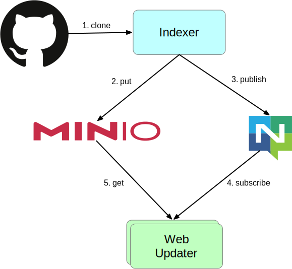

最近、自分用のコード検索を構築して運用しているがこれが意外に良い。

大きなコードベースに触るときは全体を素早く検索できる方法があるととても捗る。
だいぶ昔、大きなコードベースに触りだした頃には [ack](https://metacpan.org/pod/App::Ack) を使っていた。これはその時触っていたコードベースが巨大な Perl のアプリケーションだったというのもあり会社の人から教えてもらった。

今は ack の代わりに [the_silver_searcher](https://github.com/ggreer/the_silver_searcher) を使うことが多い。
自分では使ってないが git grep も十分に目的を達成することができると思う。

the_silver_searcher は気に入ってかなり使っているが不満点もある。

例えばブランチをまたいだ検索ができない、都度対象のファイルをすべて走査することになるのであまり効率がよくない（それでも十分速いが）などがある。

これらを解決するには [Sourcegraph](https://about.sourcegraph.com) を自分用にデプロイすれば良いかなと思っていたが、コンポーネントも多く自分用に運用していくのは少し大変だなと思って1年くらい放置をしていた。

# zoekt

[zoekt](https://github.com/google/zoekt) というコード検索エンジンがありこれを自分用に運用することにした。
Sourcegraph よりコンポーネントも少なく必要最低限であり運用しやすいかなと思ったのが採用理由。

インデックスの作成をする CLI ツールもプロジェクトの一部として含まれているのだが、結果的にその部分は自作した。
なので実際に使っているのはブラウザから検索する部分とインデックス作成のライブラリ部分だけである。

## インデックス作成

プロジェクトには GitHub からリポジトリを持ってきてインデックスを作成できるツール（ `zoekt-mirror-github` と `zoekt-repo-index` ）があるのだがこれだとやりたいことがすべてできなかった。

Go のライブラリから返ってきた error は最終的に文字列として出力されることがほとんどだと思う。その際にその文字列で発生源を探すべくコード検索をするのだが、依存の深いところにある場合などを考えるとかなり広範囲なプロジェクトをインデックスしなければいけない。

リポジトリごとに同じライブラリを使っているがバージョンが違うといったことも考えられるので、トップにあるリポジトリからすべて辿れる、もしくは検索対象を絞れるようにしたい。

幸いなことに Go modules には vendor する機能があるので、これを利用してインデックスする前にプログラム全体の **動作に必要な範囲の** ソースコードを手に入れそれを基にインデックスを作成すれば良い。

そんなインデックス作成は zoekt プロジェクトではサポートしていないのでこれは自作しなければいけない。

ということで作った。
自宅の Kubernetes クラスタで動かすので PersistentVolume を直接扱わなくてもいいようにした。
最初は Indexer と Web が一つの Pod になっており PersistentVolume でディスクを共有しつつ永続化していたがやはり直接ディスクを扱わないほうがいいだろうということで以下の形に作り変えた。

リポジトリを Clone しインデックスを作成する Indexer はスケジューラ（cron）の機能も持っている。定期的にインデックスを作成しそれをオブジェクトストレージへアップロードする。

アップロードしたことを nats-server に通知して Indexer の役目は終了となる。

zoekt-webserver はインデックスファイルが必要なのでオブジェクトストレージからインデックスファイルを取得してくるコンテナが webserver の隣にいる。
この Updater は nats-server を介して Indexer からの通知を受け取るので Indexer がインデックスの更新を完了すればすぐに反映されるようになっている。

これにより webserver が複数 Pod あっても問題なく動作するので webserver の Graceful な入れ替えも可能になっている。

## ctags

zoekt は ctags を [サポートしており](https://github.com/google/zoekt/blob/fcc0c9ab67c5e237fa886ef7a105d96c1b264d27/doc/ctags.md) インデックス作成時に利用できれば言語なども検索条件に含めることができる。

ローカルでインデックスを作成する分には universal-ctags にパスを通しておけば良いのでそれほど難しくないのだが、 Kubernetes 上で動作する Indexer で ctags を使おうと思うと少し面倒だった。

結局 universal-ctags のコードを自分のリポジトリに持ってきてそこに Bazel のビルドファイルを追加した。

ctags をビルドする際は静的リンクし、バイナリをコンテナに含めれば良いだけという状態にする。
これは Indexer のコンテナが distroless ベースになっているというのもあるし、 distroless 以外を使う気がないというのもある。

ctags のビルドには [rules_foreign_cc](https://github.com/bazelbuild/rules_foreign_cc) を使って configure && make を使っているし静的リンクするライブラリはホスト側のものなので Bazel の良さは少し失われているがビルドはできるので良いだろう。

## go mod vendor

依存モジュールを vendoring するのも少しハックが必要だった。

vendoring するには `go mod vendor` を実行する必要があるのだが、これは internal パッケージになっていてライブラリとして別のプログラムから利用することができない。
なので `go` コマンドを実行する必要があるのだが、前述の通りコンテナのベースが distroless なのでなんとかして distroless コンテナの中でコマンドを動かさないといけない。

[go のコンテナ](https://hub.docker.com/_/golang) をベースにするという手もあるが alpine ベースは使いたくない。

そこで Indexer のコンテナには公式が配布している tar を展開して含めることにした。

`http_archive` で tar を取得してきてそこへ取り出したいファイルを[定義したビルドファイルを適用](https://github.com/f110/mono/blob/e5228cb1816ad6d2203a45de5ad972c7640325c4/WORKSPACE#L193-L206)、コンテナにする前に再度 tar で固めて最終的に [1つのレイヤとしてまとめて](https://github.com/f110/mono/blob/e5228cb1816ad6d2203a45de5ad972c7640325c4/containers/zoekt-indexer/BUILD.bazel#L19-L33) ある。
