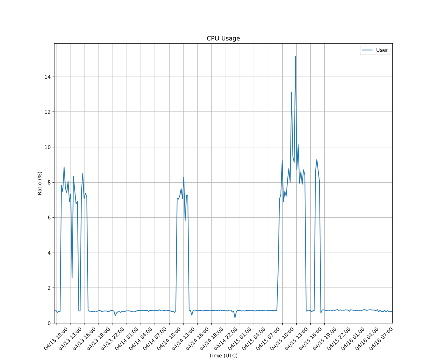
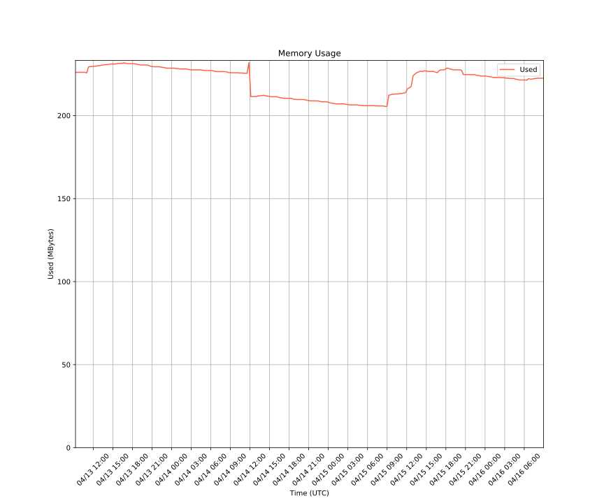

最近Factorioにすごいハマってて毎日プレイしてる。
やりすぎて1週間で仕事をしてる時間よりFactorioをプレイしてる時間の方が長いこともあるくらい。

Factorioは公式がマルチプレイ用のサーバーを提供してくれていて、自分でマルチプレイのサーバーを用意することができます。
一人で遊んでても面白くてずっとプレイできるんだけどゲームというのは誰かと一緒にプレイするともっと面白いのでマルチプレイのサーバーを動かしてプレイしてる。

幸いうちにはk8sクラスタがあってこれが24時間稼働しているのとFactorioのコミュニティがdockerコンテナをメンテしてくれているのでk8sで動かしています。

マニフェスト
================

`Helm Chart <https://github.com/helm/charts/tree/master/stable/factorio>`_ はあえて使っていなくて自分でマニフェストを書いています。

.. code::

    factorio
    ├── base
    │   ├── kustomization.yaml
    │   ├── service.yaml
    │   └── statefulset.yaml
    └── map-name
        ├── kustomization.yaml
        ├── server-adminlist.json
        └── server-settings.json

複数のマップデータを持てるようにする（マップごとに別のプロセスを起動しないといけない）ためにbaseとそれぞれのマップでディレクトリを分けていて
kustomizeでマニフェストをビルドするようにしています。

ServiceとStatefulSetだけで動く単純なアプリケーションで何かが起きると一時的に不通になることはあり得る構成。
ただこれはゲームサーバーが分散する仕組みを持っていないので許容するしかないという現状です。

不特定多数にマップを供用してるわけではなくごく少数で遊んでいるだけなのでたまに落ちてもいいくらいの気持ちで運用しています。

グローバルからのアクセスはUDPだけ通していて今のところは直接到達出来るようになっています。
これだとFactorioのプロセスに脆弱性があった場合に侵入を許しやすくなってしまうので将来的には認証の仕組みを入れる予定です。
この認証の仕組みはFactorioのゲームパスワードとは違って、そもそもプレイする人以外（信頼したユーザー以外）のパケットを受け取らないようにします。

マップの永続化
================

マップデータは当然永続化しないといけなくてゲームサーバーの再起動などで失われることがあるととても悲しくなります。

我が家のk8sクラスターはPersistentVolumeが使えるのでそれで永続化されておりブロックストレージも3つの複製があります。
この複製は全て自宅の中にあるので全ノードを消失するような事故が起きるとデータを失いますが、1ノードくらいの消失であればまったく問題ありません。
1台くらい壊れても残りのマシンでサービスが継続できます。

パフォーマンス
================

Factorioのマルチプレイのサーバーは必要なリソースが少なくてまったくCPUもメモリも使いません。
おそらくRaspberry Piのような計算資源が潤沢ではないノードだったとしても問題なくプレイできるでしょう。
うちのクラスターは最大2コアのマシンしかありませんが全く問題ありません。
一応2コアでLimitをかけていますが1コア（1000m）でも全く問題ないです。
メモリも512MBあれば十分です。

.. code::

    avg(irate(container_cpu_usage_seconds_total{namespace="factorio",container="factorio"}[5m])) by (container)

.. code::

    max(container_memory_usage_bytes{namespace="factorio",container="factorio"}) by (container)

非常にエコなゲームサーバーでとても良くできています。
