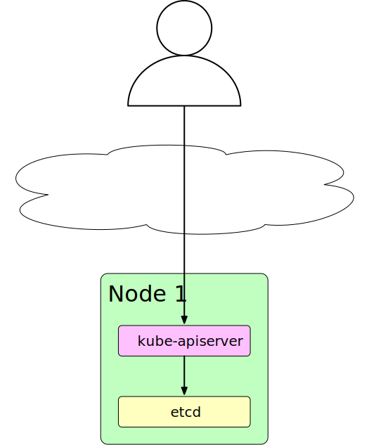
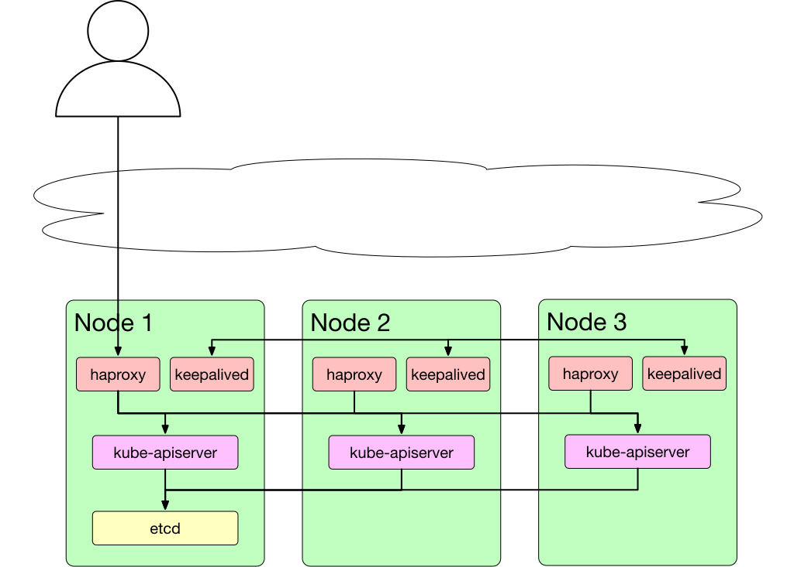

.. section-numbering::

元々masterサーバーを1台で構築したKubernetesクラスターをHA構成に変更しようとしたので、作業のメモ。
この記事ではetcdを1台構成のままkube-apiserverを複数台構成にしてロードバランサーの下に入れることを目指す。

変更前は以下のようなシンプルな構成です。

これを以下のように構成することで kube-apiserver を冗長構成にします。

前提
======

自分のクラスタを前提としています。したがって以下のようなクラスタです。

* kubeadm で構築したシングルmasterなクラスタ
* masterサーバーにはIPアドレスでアクセスしてる
* kube-apiserverは6443をListenしている

ゴール
========

* 任意のホスト名でkube-apiserverにアクセスできるようになっている
* kube-apiserverを別のノードで起動した場合もサーバー側の設定ファイルの変更だけで利用できる状態になる
* 複数台構成にした場合そのうち1台が落ちてもAPIにはアクセスできるようにする

IPアドレスとホスト名を決める
===============================

まずはロードバランサーするIPアドレスを決めます。
ここでは ``192.168.0.2`` をそのIPアドレスとします。

このIPアドレスはホストに直接割り当てたりはしません。
keepalived がヘルスチェックをし、適切にARPで上位へ広報します。

またそのアドレスを解決できるホスト名は ``cluster.f110.dev`` とします。

kube-apiserverのサーバー証明書を更新する
===========================================

最初にkube-apiserverのサーバー証明書のSANを更新します。

kubeadmで証明書を再発行しkube-apiserverでリロードします。

.. code:: console

    $ kubectl -n kube-system get configmap kubeadm-config -o jsonpath='{.data.ClusterConfiguration}' > kubeadm.yaml

kubeadm.yaml をConfigMapから取得して ``apiServer.certSANs`` を変更します。
IPアドレスとホスト名を定義しておきます。

.. code:: console

    $ sudo mv /etc/kubernetes/pki/apiserver.{crt,key} ~

すでに証明書のファイルがあるとkubeadmが証明書を生成しないのでバックアップも兼ねて退避します。

.. code:: console

    $ sudo kubeadm init phase certs apiserver --config kubeadm.yaml

kubeadm initからapiserverの証明書生成フェーズのみを実行することで新しい証明書を発行します。

これでkube-apiserverを再起動し新しい証明書を読み込ませれば切り替えることができます。
更新されたかどうかはサーバーに接続し証明書を見ることで確認できます。

.. code:: console

    $ openssl s_client -connect 192.168.0.1:6443 < /dev/null | openssl x509 -in - -text -noout

keepalivedをセットアップする
================================

keepalived はStatic Podとして動作させます。

設定ファイルは `公式ドキュメント <https://github.com/kubernetes/kubeadm/blob/master/docs/ha-considerations.md>`_ を参考にします。

設定ファイルの必要な部分を置換し適切に配置すれば動くでしょう。

Static Podのマニフェストは以下です。
これを ``/etc/kubernetes/manifests/keepalived.yaml`` として配置します。

.. code:: yaml

    apiVersion: v1
    kind: Pod
    metadata:
      name: keepalived
      namespace: kube-system
    spec:
      containers:
      - image: angelnu/keepalived
        name: keepalived
        resources: {}
        securityContext:
          capabilities:
            add:
            - NET_ADMIN
            - NET_BROADCAST
            - NET_RAW
        volumeMounts:
        - mountPath: /etc/keepalived/keepalived.conf
          name: config
        - mountPath: /etc/keepalived/check_apiserver.sh
          name: check
      hostNetwork: true
      volumes:
      - hostPath:
          path: /etc/keepalived/keepalived.conf
        name: config
      - hostPath:
          path: /etc/keepalived/check_apiserver.sh
        name: check

公式ドキュメントとイメージが違いますが、これはkeepalivedをRaspberry Pi上（arm）で動かすためなので、プロセスが動作すればこれでなくても問題ありません。

haproxyをセットアップする
===========================

これも公式ドキュメントの設定ファイルを利用しますが、そのままでは都合が悪かったので少し手直しをしました。

.. code::

    #---------------------------------------------------------------------
    # Global settings
    #---------------------------------------------------------------------
    global
        log /dev/log local0
        log /dev/log local1 notice
        daemon

    #---------------------------------------------------------------------
    # common defaults that all the 'listen' and 'backend' sections will
    # use if not designated in their block
    #---------------------------------------------------------------------
    defaults
        mode                    http
        log                     global
        option                  httplog
        option                  dontlognull
        option http-server-close
        option forwardfor       except 127.0.0.0/8
        option                  redispatch
        retries                 1
        timeout http-request    10s
        timeout queue           20s
        timeout connect         5s
        timeout client          300s
        timeout server          300s
        timeout http-keep-alive 10s
        timeout check           10s

    #---------------------------------------------------------------------
    # apiserver frontend which proxys to the masters
    #---------------------------------------------------------------------
    frontend apiserver
        bind \*:443
        mode tcp
        option tcplog
        default_backend apiserver

    frontend stats
        bind \*:8404
        stats enable
        stats uri /stats
        stats refresh 30s
        stats admin if LOCALHOST

    #---------------------------------------------------------------------
    # round robin balancing for apiserver
    #---------------------------------------------------------------------
    backend apiserver
        option httpchk GET /healthz
        http-check expect status 200
        mode tcp
        balance     roundrobin
        server whale1 192.168.0.2:6443 check check-ssl verify none

公式ドキュメントからの変更点は以下

* タイムアウトを300秒に延長
* 443をListenする
* 8404でstatsを見れるようにする
* backendにはL4でロードバランスする
* healthcheckで証明書の検証はしない

haproxyを動作させるStatic Podのマニフェストは以下。

.. code:: yaml

    apiVersion: v1
    kind: Pod
    metadata:
      name: haproxy
      namespace: kube-system
    spec:
      containers:
      - image: haproxy:2.2.2
        name: haproxy
        livenessProbe:
          failureThreshold: 8
          tcpSocket:
            host: 127.0.0.1
            port: 443
        volumeMounts:
        - mountPath: /usr/local/etc/haproxy/haproxy.cfg
          name: haproxyconf
          readOnly: true
      hostNetwork: true
      volumes:
      - hostPath:
          path: /etc/haproxy/haproxy.cfg
          type: FileOrCreate
        name: haproxyconf

Liveness Probeを ``tcpSocket`` に変えてあります。

kubectlで動作確認
===================

この時点でロードバランサー経由でkube-apiserverへアクセスできるか確認しておきましょう。

kube-apiserverの引数を修正する
=================================

``--advertise-address`` をロードバランサーのIPアドレスに変更します。

これはkubeadmでできればそうした方がいいでしょう。
今回は手動で編集してしまいました。

各コンポーネントの接続先をホスト名にする
==========================================

kube-controller-manager や kube-scheduler は kubeconfig を利用し接続先を決めています。
そのためこの kubeconfig を変更しなければロードバランサー経由のアクセスにはなりません。

* ``/etc/kubernetes/kubelet.conf``
* ``/etc/kubernetes/controller-manager.conf``
* ``/etc/kubernetes/scheduler.conf``

がそれぞれの kubeconfig なので修正しましょう。

コントローラーなどが正しく動作しているか確認する
====================================================

自作やサードパーティのコントローラーが正しく動作しているか確認してください。

多くの場合は InClusterConfig() を利用していると思います。
その場合は ``kubernetes.default.svc`` を通してkube-apiserverへアクセスしているのでここからも正しくアクセスできる必要があります。

上記で ``--advertise-address`` を変更していれば正しくアクセスできるようになっているはずです。

アクセスできない場合は ``Endpoints`` を確認します。

.. code:: console

    $ kubectl get endpoints
