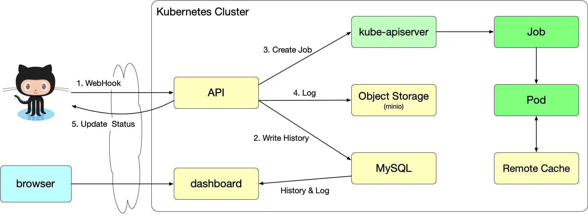
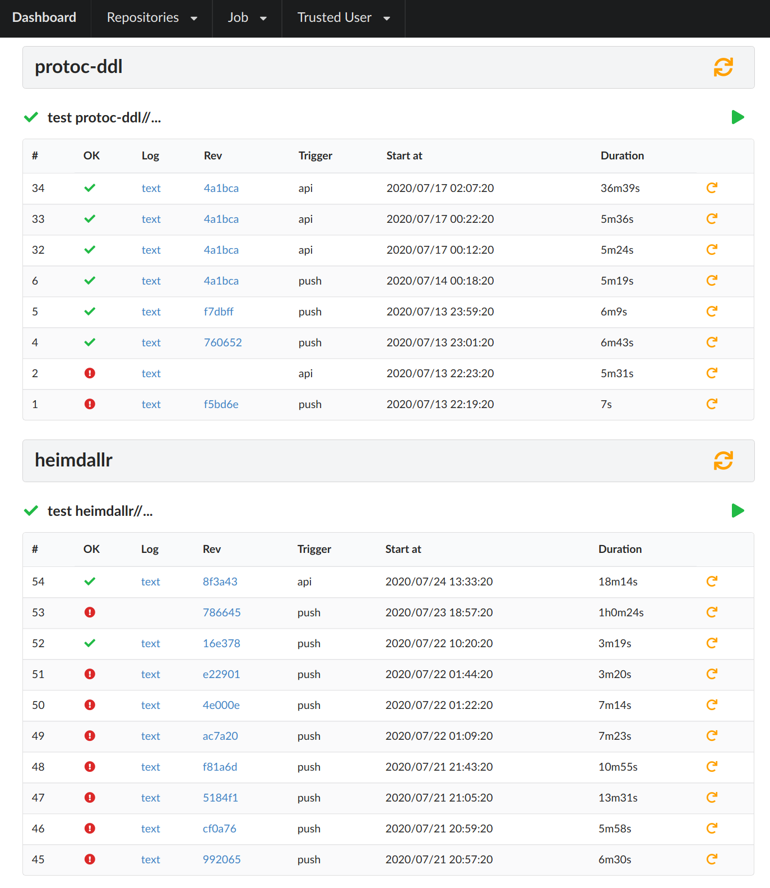

これまでにいろいろなCIツールを試し・使い、自分でも運用してきましたが満足できるツールはありませんでした。

これまでに試したり使ったツールは

* Jenkins
* Drone
* Concourse CI

に加えてジョブスケジューラとして

* Rundeck

などです。

いずれのツールでもCIパイプラインの定義に次のような課題があり、それを解決しているものはありませんでした。

* パイプラインの定義がシェルスクリプトになりがち
* パイプライン自体のテストができない
* 手元でパイプラインを再現できない（全てのツールではない）
* リモートと手元での環境の差異によりデバッグが難しい

自分のリポジトリは全て Bazel をビルドツールとしているため、 Bazel に特化したCIツールがあるとこれらの問題を解決できるかもしれないと考え、
自分で作り事にしました。

# 自作CIツール

## 自作以外の選択肢

Bazel プロジェクト関連は [Buildkite](https://buildkite.com/) を使っていることが多いようです。

## 要件

* Kubernetesクラスタ上で全て動作すること
* WebHook をトリガーにビルドを開始できること
* テストだけではなくタスクランナーとしても機能すること
* 設定ファイルとして yaml は使わない

## スコープ外

以下は初期の実装スコープから外しました。

* Bazel serverを常時起動しない
  * analyzeフェーズをして待機できるのでビルドの高速化が見込める
* Remote Build Execution (RBE)は使わない

## ポイント

全ての起点に Bazel を使っています。
Bazelを利用することでパイプラインが（Bazel利用者にとっては）整理された状態にできます。

また任意のシェルスクリプトをパイプラインに差し込むことはできないようにしています。
必ず Bazel の下で実行します。

これによりローカルでもリモートでも環境の差異が **少なくなります。**
（残念ながら完全になくすことはできませんが、 Bazel のおかげでリモートで起きた問題をローカルでも再現しやすいだろうということが見込まれます）

設定ファイルとして yaml を使わないというのも過去の反省からです。
yaml ファイルだと何が設定できるのか分からないというのとデータ構造による "設定ファイル" になってしまうので今回は避けました。

## Overview



（画像は別タブで開いて原寸大で見てください）

1. GitHub から WebHook をAPIサーバーで受け取ります
1. MySQL にビルド履歴のレコードを作成します
1. ビルドの設定に従いKubernetesのJobオブジェクトを作成します
1. Jobの完了を監視し、完了したらログファイルをObject Storageへ書き込みます
1. Commit Statusをビルド結果に応じてセットします

API は HTTP サーバーと kubernetes controller の2つが1つになったサービスになっているのが特徴です。

## ビルドの設定ファイル

ビルドパイプラインも Bazel のターゲットの一つで、ルールとして [定義されています。](https://github.com/f110/mono/blob/82f8ffaa8aa1aeee2ecd74ab17892499da3b36f3/build/job.bzl#L4-L18)

ルールの中身は何も実装されていないので Bazel で直接実行しても何も生成されません。
このルールから [定義されたターゲット](https://github.com/f110/sandbox/blob/ec73883492860c5ac5e75ee475ad435d94fc7165/BUILD.bazel#L10-L17) がビルドパイプラインとなります。

なので Bazel を使い慣れた人でなければどのように使っていいか分からないでしょう。
一方使い慣れた人にとっては手に馴染んだ道具でビルドパイプラインも同様に定義できるので分かりやすいのではないでしょうか。

特定のルールから定義されたターゲット一覧を取り出すために各リポジトリで以下のクエリを Bazel で実行しています。

```console
$ bazel cquery 'kind(job, //...)' --output jsonproto 2> /dev/null
```

## スクリーンショット

実際の画面は認証プロキシの背後にあり、自分以外がアクセスできないので以下にスクリーンショットを貼っておきます。


