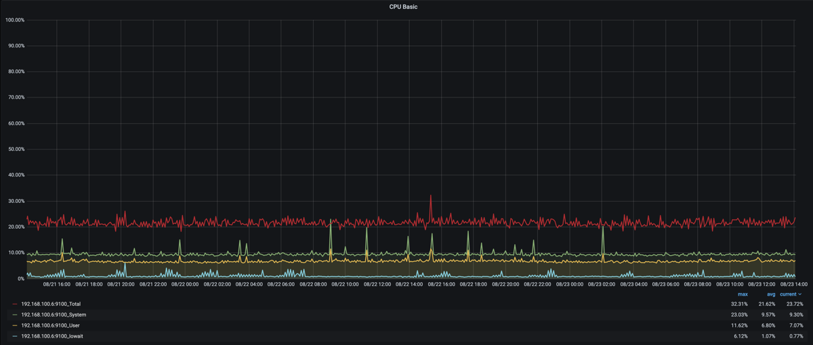
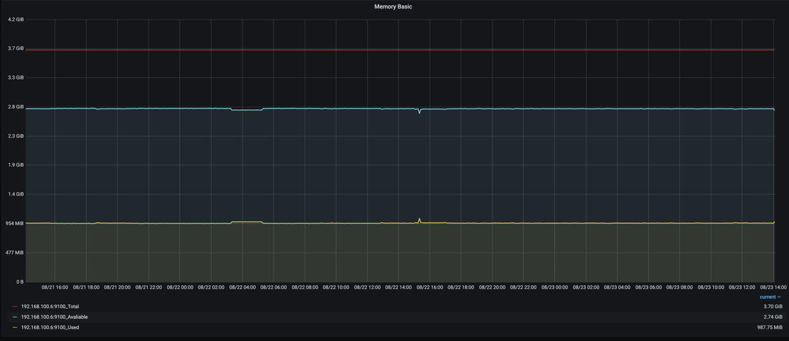

Homecluster は Intel NUC を3台で構成していて、ここにコントロールプレーンも同居していました。
しかしこの構成はNUCがそこまで安価ではない故にコントロールプレーンが冗長構成になっていませんでした。

1台構成の場合、コントロールプレーンが入っているノードのアップグレードが難しい（長い時間オフラインになってしまう）という問題があります。
当初よりコントロールプレーンを Raspberry Pi で構成しようというのは考えていたので、この度 Raspberry Pi によるコントロールプレーンの検証を始めました。

今回使用したのは Raspberry Pi 4 Model B 4GB です。

# Raspberry Piをコントロールプレーンにするポイント

## 性能の良いSDカードを使う

性能が悪いSDカードを使うとetcdのクラスタで度々Leader changeが起きます。

Leader changeが起きると各コントローラのLeader electionも再度行われるため、非常のパフォーマンスが悪くなります。

そのため性能の良いSDカードを使うのは必須です。

性能が良いSDカードかどうかは [公式のテストツール](https://www.raspberrypi.org/blog/sd-card-speed-test/) でチェックすることができます。

## ファンはつけておく

Raspberry Pi 4 は発熱が大きくなっています。
ファンレスだとアイドリングでもかなり高温になります。
負荷をかけたら間違いなく動作クロックが下がるか、シャットダウンしてしまうでしょう。

kube-apiserver がCPUを少し使うのでファンは必須です。

ファンをつけていると温度は50度強で安定します。
（どれくらいの温度の空気を吸い込めるかで少し変わります。ラズパイはスタックすることが多いと思うのでその場合はより下側の温度を気にしましょう）

## メモリは4GBでOK

8GBのモデルも発売されていますが、コントロールプレーンとして使うのであれば4GBモデルで問題ありません。

実メモリで1GB程度を使っている程度なので8GBモデルは不要でした。
（ノードが5台、Podが160、コンテナが200程度のクラスタ）

## CPU使用率

CPUは kube-apiserver と etcd で常時25%くらいを使っています。

SDカードの性能が悪い場合はio waitが出てくるのでそれで気がつくことができます。

## メモリ使用量

1GB使っています。

# PoE Hatが品切れ

Raspberry Piと一緒にPoE Hatも注文しました。

しかしこちらは未だに入荷しません。
せっかくなのでPoEにしてケーブル1本のスッキリ配線にしようと思ったのですが…
