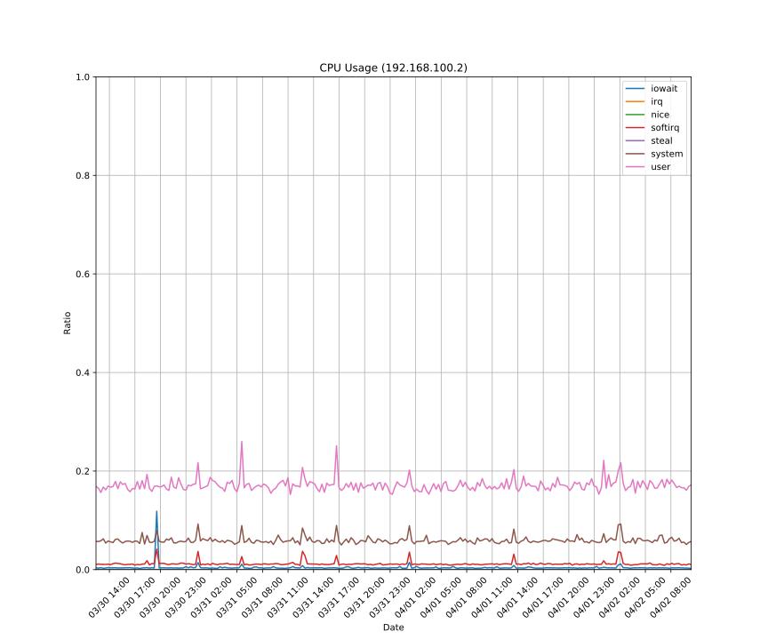

Prometheusが収集しているメトリクスから少しだけまともなグラフの画像を生成する方法です。

大まかに次のステップで画像を生成します。

1. グラフのデータにするクエリを用意する
1. そのクエリの結果をCSVでエクスポートする
1. スクリプトでグラフの体裁を整える

# クエリを用意する

グラフのデータはなるべくPrometheusで計算させてしまいます。

この時ラベルは自分が分かる程度でよく、グラフにするにあたって必要な情報が欠けてなければ問題ありません。

ここでは次のクエリ使うことにします。

```
avg(irate(node_cpu_seconds_total[1m])) by (instance, mode)
```

クエリを組み立てる時は Prometheus のUIを利用してデータを見たり簡易的にグラフにして確かめるようにしてください。
ここで意図しないクエリを作ってしまうと元も子もありません。

# CSVでエクスポートする

Prometheusに任意のクエリを投げてCSVでエクスポートできるツールを使います。

[github.com/go-pluto/styx](https://github.com/go-pluto/styx) は簡単なCLIツールで任意の Prometheus にクエリを投げてCSVを出力できる便利なコマンドです。

```console
$ go get github.com/go-pluto/styx
```

でインストールできます。

以下のようにコマンドを実行します。

```console
$ styx --prometheus https://prometheus.example.com --duration 24h 'avg(irate(node_cpu_seconds_total[1m])) by (instance, mode)' > data.csv
```

使用するPrometheusのアドレスは `--prometheus` 期間は `--duration` で指定します。

が、 `go-pluto/styx` はCSVを単純な文字列結合で出力しており壊れたCSVが出力されることがほとんどでしょう。
`csv.Writer` を使ってちゃんとしたCSVを出力するように変更する必要があります。

https://github.com/f110/styx にその変更を加えたコードを置いておきます。

# グラフを描く

最後にグラフを描きます。好きなツールで描いてください。
今回は [matplotlib](https://matplotlib.org/) を使います。

```python
import pandas
import matplotlib.pyplot as plot
import matplotlib.dates as dates
from datetime import datetime

def parse_label(label):
    x = [v.split('="') for v in label[1:-1].split(",")]
    return dict([[v[0], v[1][:-1]] for v in x])

d = pandas.read_csv('data.csv')
time = [datetime.utcfromtimestamp(x) for x in d['Time']]

columns = dict([(x, parse_label(x)) for x in d.columns if x != 'Time'])

fig = plot.figure(figsize = (12, 10))
ax = fig.add_subplot(111)

for col, v in columns.items():
    if "192.168.100.2" in v["instance"] and v["mode"] != "idle":
        ax.plot(time, d[col], label = v['mode'])

ax.set_title("CPU Usage (192.168.100.2)")
ax.set_xlabel("Date")
ax.set_ylabel("Ratio")
ax.set_xlim(time[0], time[-1])
ax.set_ylim(0, 1)
ax.xaxis.set_major_locator(dates.HourLocator(interval = 3))
ax.xaxis.set_major_formatter(dates.DateFormatter("%m/%d %H:%M"))
ax.grid(True)
ax.legend()

plot.setp(ax.get_xticklabels(), rotation = 45)
plot.show()
```

データをファイルに保存すると



といったグラフが出力されます。

一度テンプレートを作っておけば使い回しはそれほど難しくなさそうですね。
